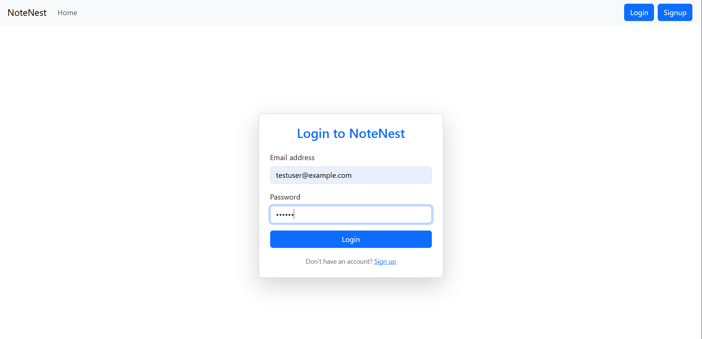
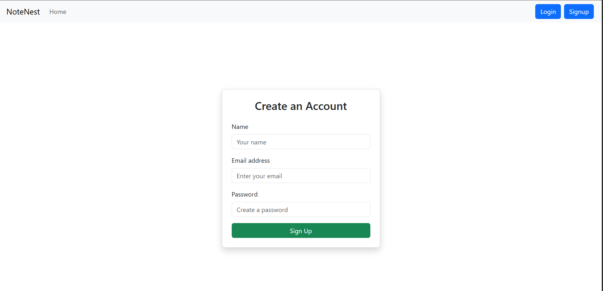
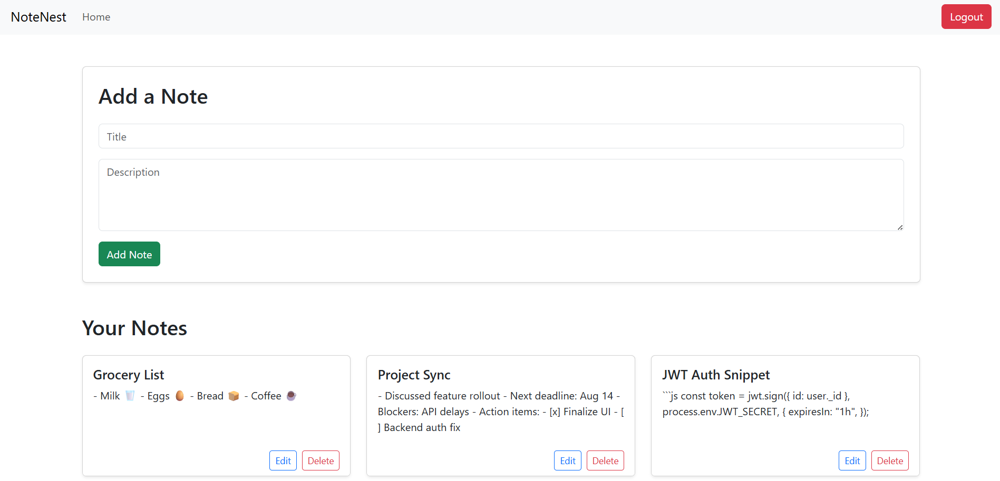
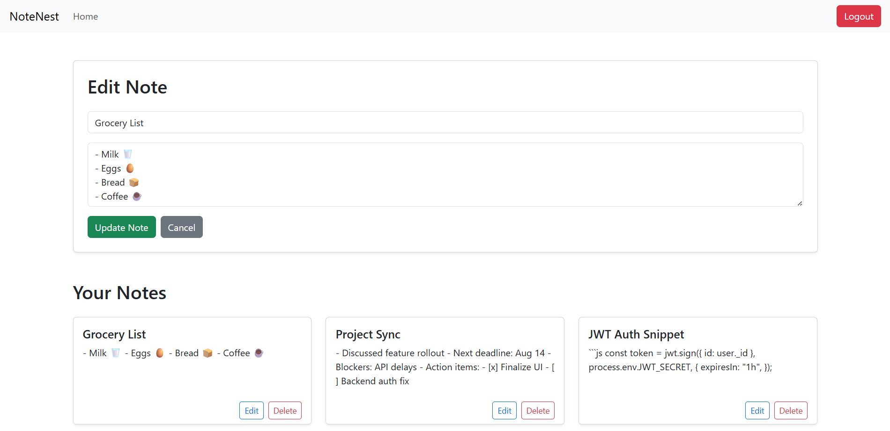
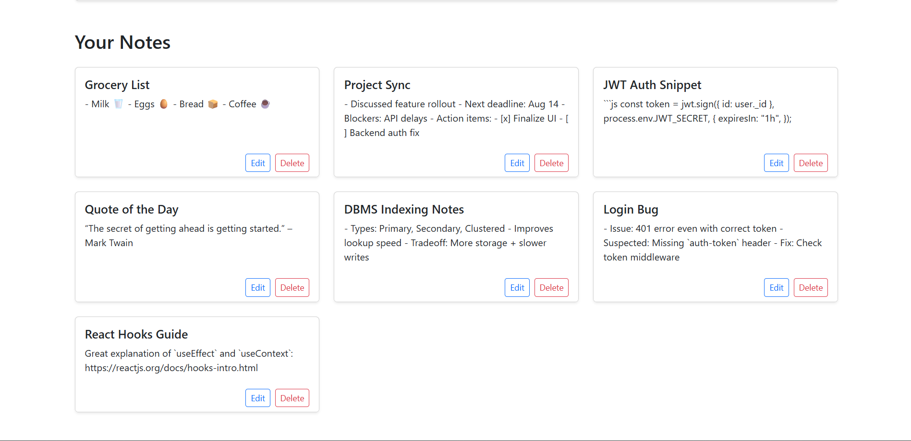
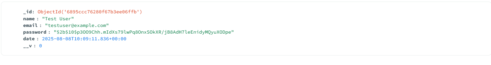
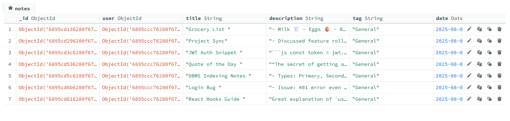

# 📝 NoteNest

NoteNest is a full-stack **MERN (MongoDB, Express, React, Node.js)** application that allows authenticated users to create, read, update, and delete personal notes securely.

## 🚀 Features

- 🔐 **JWT-based authentication** (Signup / Login / Logout)
- 📝 **Create, edit, and delete notes**
- 🌐 **RESTful APIs**
- 💾 **MongoDB database integration**
- 💡 **User-specific notes only (private)**
- ⚛️ **React UI with Context API**
- 📱 **Responsive design with Bootstrap**

---

## 🌍 Live Demo

🔗 [NoteNest Live App](https://notenest-notebook.netlify.app) 

> You can sign up with your email and create personal notes after logging in.
 
## 🖼️ Screenshots

📌 Login Page 


📌 Signup Page


📌 Notes Dashboard




📌 MongoDB Stored Data



---

## 📁 Folder Structure

NoteNest/
├── backend/ # Express + MongoDB + Auth API
│ ├── config/
│ ├── middleware/
│ ├── models/
│ ├── routes/
│ ├── .env
│ └── index.js
│
├── frontend/ # React frontend with routing + context
│ ├── components/
│ ├── context/
│ ├── pages/
│ ├── App.js
│ └── index.js
│
├── .gitignore
├── README.md
└── package.json


---

## ⚙️ Setup Instructions

### 📌 Prerequisites

- Node.js (v16+)
- MongoDB (local or Atlas)

### 🔧 Backend Setup

```bash
cd backend
npm install

Create a .env file inside /backend:

MONGO_URI=your_mongodb_connection_string
JWT_SECRET=your_jwt_secret_key

Start the server:
npm start

💻 Frontend Setup
cd frontend
npm install
npm start

🔒 Environment Variables
Make sure the following variables are defined in /backend/.env:

Key	Description
MONGO_URI	MongoDB connection string
JWT_SECRET	Secret key for signing tokens

📦 Tech Stack
Frontend: React.js, Bootstrap, Context API

Backend: Node.js, Express.js, MongoDB, JWT

Database: MongoDB (Mongoose)

Auth: JSON Web Token (JWT)

✍️ Author
Aman Kumar Sharma

Feel free to connect and share your feedback!


